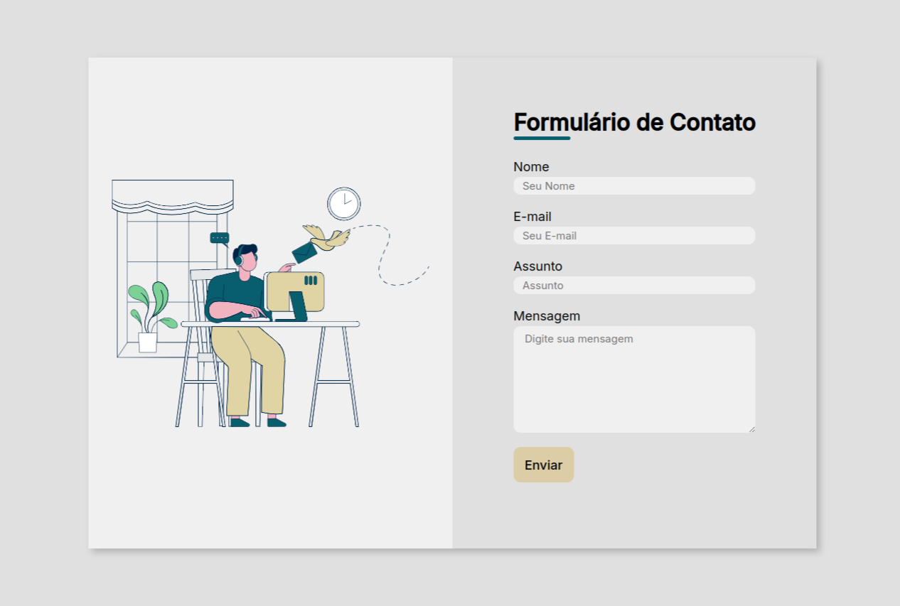

# Formulário para envio de e-mail com PHP

## 🚀 Introdução
Um formulário simples com a funcionalidade de envio de email com PHP.

### Visualização da página do formulário

## 📦 Tecnologias usadas

Visual Studio Code: É um editor de código desenvolvido pela Microsoft para Windows, Linux e macOS.

HTML: É uma linguagem de marcação utilizada para construir páginas da web.

CSS: É um mecanismo para adicionar estilos a uma página da web.

PHP: É uma linguagem de programação utilizada para construir sites dinâmicos, extensões de integração de aplicações e também para agilizar no desenvolvimento de um sistema.

Apache: É um servidor web livre e de código aberto.
